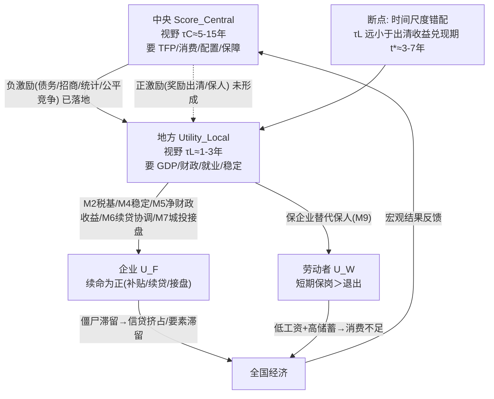

# ②《中央—地方激励错配图》

> EGS 调研合成交付物 #2 ｜ 2026-09-06
> 汇聚：线A（Q14 时间尺度错配）、线B（B1 B2）、线C（C2）
> 证据分级：[E]/[R]/[INF]

## 1. 四个主体的收益函数（错配总图）

$$
S_C(T)=\int_0^T e^{-\rho t}\big[a_1\text{TFP}+a_2\text{Cn}+a_3\text{Alloc}+a_4\text{FS}+a_5\text{SS}+a_6\text{Ext}\big]dt
$$

$$
U_L(\tau_L)=\sum_{t=1}^{\tau_L}\delta^t\Big\{\gamma_1\text{GDP}+\gamma_2\text{Fisc}+\gamma_3\text{Empl}+\gamma_4\text{KeyFirm}+\gamma_5\text{Project}+\gamma_6\text{Attr}+\gamma_7\text{Stab}-\gamma_8\text{Debt}-\gamma_9\text{LFR}\Big\}
$$

**企业收益** $U_F$：短期看续命（补贴/续贷/接盘）为正、退出为负；长期看僵尸化压缩自身 TFP 与回报。
**劳动者收益** $U_W$：短期保岗 > 退出；长期看"保障兜底"的退出转移优于"低工资滞留"。

## 2. 中央收益 / 地方收益 对比矩阵（出清 vs 续命）

| 策略 | 中央 $R_C$（视野 5–15 年） | 地方 $R_L$（视野 1–3 年） | 冲突 |
|---|---|---|---|
| **结构性出清** | t=1 负；t=3–7 TFP↑/消费↑ → $R_C(5)>0$ | t=1 GDP↓/就业↓/税收↓ → $R_L(1)<0$，收益给继任 | **时间错配 + 成本私有化** |
| **企业续命** | 资源滞留、错配累积、远期 TFP↓ → 负 | t=1 稳税基/稳就业/稳平安 → 正 | **估值相反** |

## 3. 错配结构图（EGS 反馈链断点）

## 4. 四个错配根源（优先级排序）

1. **时间尺度错配**（$\tau_L<\tau_C$）：出清成本落任内、收益落继任 → 干部把坏消息推迟。
2. **收益公共化 / 成本私有化**：出清收益是全国公共品，出清成本是本地私品。
3. **锦标赛排名刚性**：相对排名仍有意义 → GDP 权重并未因"不简单以GDP论英雄"而失效。
4. **保企业=保稳定 + 税基**：社会安全网与常住地公共服务不健全时，"保企即保人"成立。

## 5. 盒式结论（交付物②）

$$
\boxed{
\begin{aligned}
& \text{激励错配的核心不对称} = \textcolor{red}{\text{时间尺度差}} + \textcolor{red}{\text{收益公共化/成本私有化}} + \textcolor{red}{\text{锦标赛排名刚性}}。\\
& \text{中央已完成的是"负激励"层（债务/招商/统计/公平竞争）；缺的是能让} \ R_L(\text{出清})>R_L(\text{续命}) \ \text{的"正激励"层。}\\
& \Rightarrow \ \text{只要} \ \tau_L < t^* \approx 3\text{–}7\ \text{年，地方"把坏消息推迟"是严格占优；错配在} \ \textcolor{red}{\text{经济下行期最尖锐}}。
\end{aligned}
}
$$

*> 机制细节（M1–M10）见 `01_线B_激励错配/B1_中央地方激励错配_初稿.md`；地区截面（A/B/C 三类激励系统）见 `B2_县域vs大城市激励系统_初稿.md`。*